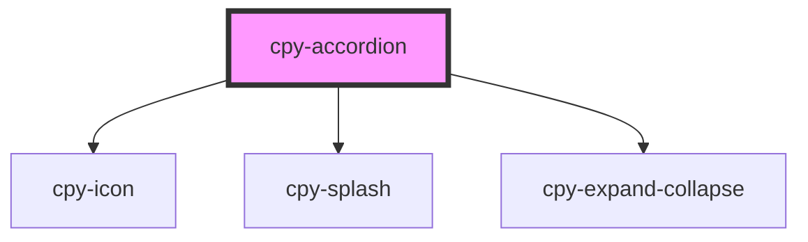

# cpy-accordion

<!-- Auto Generated Below -->

## Properties

| Property      | Attribute      | Description | Type                              | Default     |
| ------------- | -------------- | ----------- | --------------------------------- | ----------- |
| `headerTitle` | `header-title` |             | `string`                          | `undefined` |
| `opened`      | `opened`       |             | `boolean`                         | `undefined` |
| `size`        | `size`         |             | `"default" \| "large" \| "small"` | `'default'` |

## Events

| Event             | Description | Type                |
| ----------------- | ----------- | ------------------- |
| `accordionOpened` |             | `CustomEvent<void>` |

## Methods

### `close() => Promise<void>`

#### Returns

Type: `Promise<void>`

### `open() => Promise<void>`

#### Returns

Type: `Promise<void>`

### `toggle() => Promise<void>`

#### Returns

Type: `Promise<void>`

## Dependencies

### Depends on

- [cpy-icon](../icon)
- [cpy-splash](../splash)
- [cpy-expand-collapse](../expand-collapse)

### Graph

----------------------------------------------

*Built with [StencilJS](https://stenciljs.com/)*
