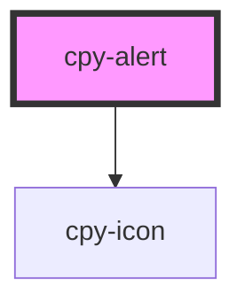

# cpy-alert

<!-- Auto Generated Below -->

## Properties

| Property     | Attribute    | Description | Type                                                                  | Default   |
| ------------ | ------------ | ----------- | --------------------------------------------------------------------- | --------- |
| `appearance` | `appearance` |             | `"border" \| "soft"`                                                  | `'soft'`  |
| `container`  | `container`  |             | `boolean`                                                             | `true`    |
| `type`       | `type`       |             | `"basic" \| "error" \| "info" \| "primary" \| "success" \| "warning"` | `'error'` |

## Dependencies

### Depends on

- [cpy-icon](../icon)

### Graph

----------------------------------------------

*Built with [StencilJS](https://stenciljs.com/)*
