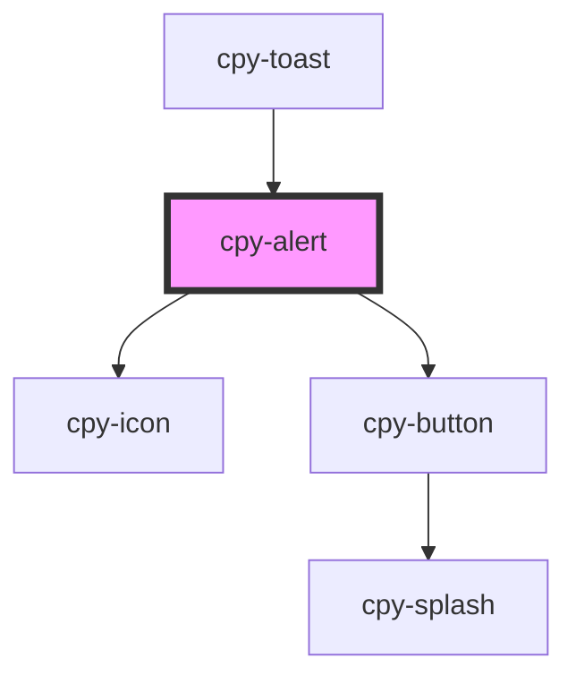

# cpy-alert

<!-- Auto Generated Below -->

## Properties

| Property      | Attribute     | Description | Type                                                                    | Default     |
| ------------- | ------------- | ----------- | ----------------------------------------------------------------------- | ----------- |
| `appearance`  | `appearance`  |             | `"border" \| "soft"`                                                    | `'soft'`    |
| `container`   | `container`   |             | `boolean`                                                               | `true`      |
| `dismissible` | `dismissible` |             | `boolean`                                                               | `undefined` |
| `icon`        | `icon`        |             | `string`                                                                | `undefined` |
| `type`        | `type`        |             | `"basic" \| "error" \| "primary" \| "secondary" \| "success" \| "warn"` | `undefined` |

## Events

| Event    | Description | Type                |
| -------- | ----------- | ------------------- |
| `closed` |             | `CustomEvent<void>` |

## Dependencies

### Used by

 - [cpy-toast](../toast)

### Depends on

- [cpy-icon](../icon)
- [cpy-button](../button)

### Graph

----------------------------------------------

*Built with [StencilJS](https://stenciljs.com/)*
