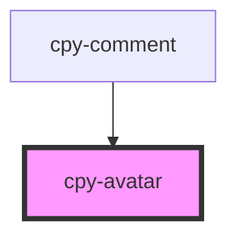

# cpy-avatar

<!-- Auto Generated Below -->

## Properties

| Property   | Attribute  | Description | Type                                           | Default     |
| ---------- | ---------- | ----------- | ---------------------------------------------- | ----------- |
| `border`   | `border`   |             | `boolean`                                      | `false`     |
| `initials` | `initials` |             | `string`                                       | `undefined` |
| `size`     | `size`     |             | `"default" \| "large" \| "small" \| "x-large"` | `'default'` |
| `src`      | `src`      |             | `string`                                       | `undefined` |
| `type`     | `type`     |             | `"rounded" \| "square"`                        | `'rounded'` |

## Dependencies

### Used by

 - [cpy-comment](../comment)

### Graph

----------------------------------------------

*Built with [StencilJS](https://stenciljs.com/)*
