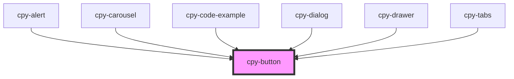

# cpy-button

<!-- Auto Generated Below -->

## Properties

| Property     | Attribute    | Description | Type                                                                    | Default     |
| ------------ | ------------ | ----------- | ----------------------------------------------------------------------- | ----------- |
| `appearance` | `appearance` |             | `"borderless" \| "fill" \| "outline"`                                   | `'fill'`    |
| `disabled`   | `disabled`   |             | `boolean`                                                               | `false`     |
| `icon`       | `icon`       |             | `boolean`                                                               | `false`     |
| `size`       | `size`       |             | `"default" \| "large" \| "small"`                                       | `'default'` |
| `type`       | `type`       |             | `"basic" \| "error" \| "primary" \| "secondary" \| "success" \| "warn"` | `'primary'` |

## Dependencies

### Used by

 - [cpy-alert](../alert)
 - [cpy-carousel](../carousel)
 - [cpy-code-example](../code-example)
 - [cpy-dialog](../dialog)
 - [cpy-drawer](../drawer-container/drawer)
 - [cpy-tabs](../tabs)

### Graph

----------------------------------------------

*Built with [StencilJS](https://stenciljs.com/)*
