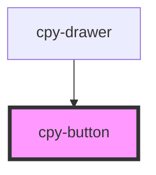

# cpy-button

<!-- Auto Generated Below -->

## Properties

| Property     | Attribute    | Description | Type                                                | Default     |
| ------------ | ------------ | ----------- | --------------------------------------------------- | ----------- |
| `appearance` | `appearance` |             | `"basic" \| "primary" \| "secondary" \| "tertiary"` | `'primary'` |
| `disabled`   | `disabled`   |             | `boolean`                                           | `false`     |
| `type`       | `type`       |             | `"default" \| "icon"`                               | `'default'` |

## Dependencies

### Used by

 - [cpy-drawer](../drawer)

### Graph

----------------------------------------------

*Built with [StencilJS](https://stenciljs.com/)*
