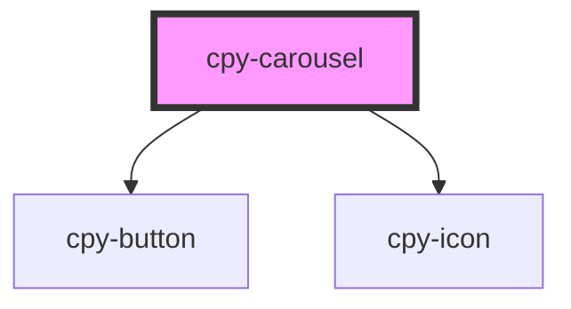

# cpy-carousel

<!-- Auto Generated Below -->

## Properties

| Property        | Attribute        | Description | Type     | Default     |
| --------------- | ---------------- | ----------- | -------- | ----------- |
| `carouselTitle` | `carousel-title` |             | `string` | `undefined` |

## Dependencies

### Depends on

- [cpy-button](../button)
- [cpy-icon](../icon)

### Graph

----------------------------------------------

*Built with [StencilJS](https://stenciljs.com/)*
