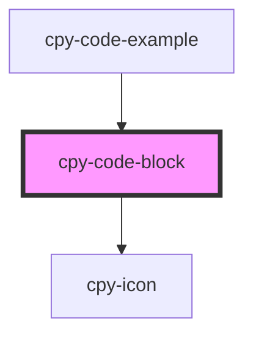

# cpy-code-block

<!-- Auto Generated Below -->

## Properties

| Property   | Attribute  | Description | Type                                                                             | Default        |
| ---------- | ---------- | ----------- | -------------------------------------------------------------------------------- | -------------- |
| `code`     | `code`     |             | `string`                                                                         | `undefined`    |
| `language` | `language` |             | `"css" \| "html" \| "javascript" \| "json" \| "scss" \| "shell" \| "typescript"` | `'typescript'` |

## Dependencies

### Used by

 - [cpy-code-example](../code-example)

### Depends on

- [cpy-icon](../icon)

### Graph

----------------------------------------------

*Built with [StencilJS](https://stenciljs.com/)*
