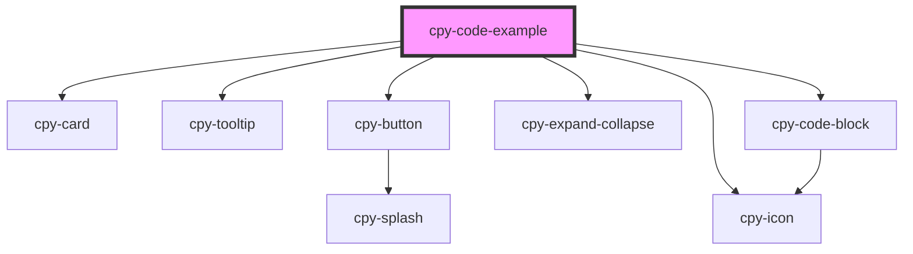

# cpy-code-example

<!-- Auto Generated Below -->

## Properties

| Property   | Attribute   | Description | Type                                                                             | Default     |
| ---------- | ----------- | ----------- | -------------------------------------------------------------------------------- | ----------- |
| `code`     | `code`      |             | `string`                                                                         | `undefined` |
| `header`   | `header`    |             | `any`                                                                            | `undefined` |
| `language` | `language`  |             | `"css" \| "html" \| "javascript" \| "json" \| "scss" \| "shell" \| "typescript"` | `'html'`    |
| `showCode` | `show-code` |             | `boolean`                                                                        | `false`     |

## Dependencies

### Depends on

- [cpy-card](../card)
- [cpy-tooltip](../tooltip)
- [cpy-button](../button)
- [cpy-icon](../icon)
- [cpy-expand-collapse](../expand-collapse)
- [cpy-code-block](../code-block)

### Graph

----------------------------------------------

*Built with [StencilJS](https://stenciljs.com/)*
