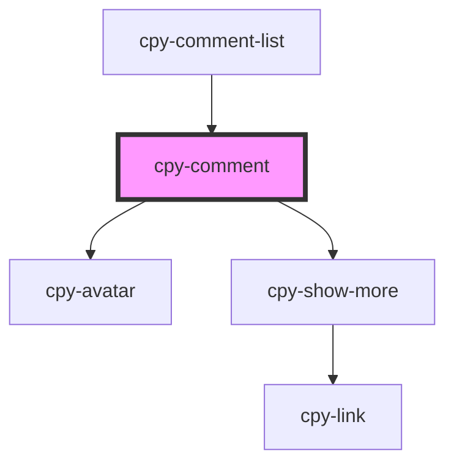

# cpy-comment

<!-- Auto Generated Below -->

## Properties

| Property       | Attribute        | Description | Type                                  | Default     |
| -------------- | ---------------- | ----------- | ------------------------------------- | ----------- |
| `comment`      | --               |             | `CommentItem`                         | `undefined` |
| `hideAvatar`   | `hide-avatar`    |             | `boolean`                             | `false`     |
| `maxLines`     | `max-lines`      |             | `number`                              | `null`      |
| `rightAligned` | `right-aligned`  |             | `boolean`                             | `false`     |
| `showLessText` | `show-less-text` |             | `string`                              | `undefined` |
| `showMoreText` | `show-more-text` |             | `string`                              | `undefined` |
| `size`         | `size`           |             | `"default" \| "large" \| "small"`     | `'default'` |
| `type`         | `type`           |             | `"basic" \| "primary" \| "secondary"` | `'primary'` |

## Dependencies

### Used by

 - [cpy-comment-list](../comment-list)

### Depends on

- [cpy-avatar](../avatar)
- [cpy-show-more](../show-more)

### Graph

----------------------------------------------

*Built with [StencilJS](https://stenciljs.com/)*
