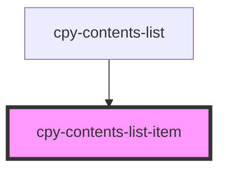

# cpy-contents-list-item

<!-- Auto Generated Below -->

## Properties

| Property | Attribute | Description | Type               | Default     |
| -------- | --------- | ----------- | ------------------ | ----------- |
| `active` | `active`  |             | `boolean`          | `false`     |
| `item`   | --        |             | `ContentsListItem` | `undefined` |

## Events

| Event     | Description | Type                |
| --------- | ----------- | ------------------- |
| `clicked` |             | `CustomEvent<void>` |

## Dependencies

### Used by

 - [cpy-contents-list](..)

### Graph

----------------------------------------------

*Built with [StencilJS](https://stenciljs.com/)*
