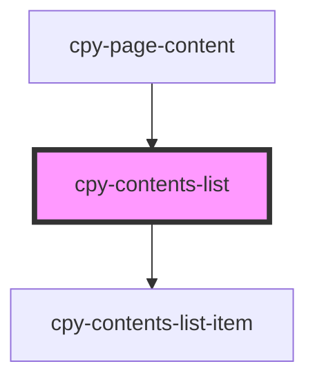

# cpy-contents-list

<!-- Auto Generated Below -->

## Properties

| Property      | Attribute      | Description | Type                 | Default      |
| ------------- | -------------- | ----------- | -------------------- | ------------ |
| `activeIndex` | `active-index` |             | `number`             | `undefined`  |
| `headerTitle` | `header-title` |             | `string`             | `'Contents'` |
| `items`       | --             |             | `ContentsListItem[]` | `undefined`  |

## Dependencies

### Used by

 - [cpy-page-content](../page-content)

### Depends on

- [cpy-contents-list-item](contents-list-item)

### Graph

----------------------------------------------

*Built with [StencilJS](https://stenciljs.com/)*
