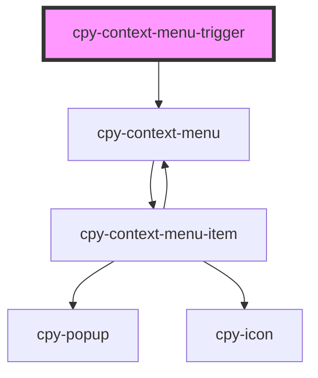

# cpy-context-menu-trigger

<!-- Auto Generated Below -->

## Properties

| Property | Attribute | Description | Type                | Default |
| -------- | --------- | ----------- | ------------------- | ------- |
| `items`  | --        |             | `ContextMenuItem[]` | `[]`    |

## Dependencies

### Depends on

- [cpy-context-menu](../context-menu)

### Graph

----------------------------------------------

*Built with [StencilJS](https://stenciljs.com/)*
