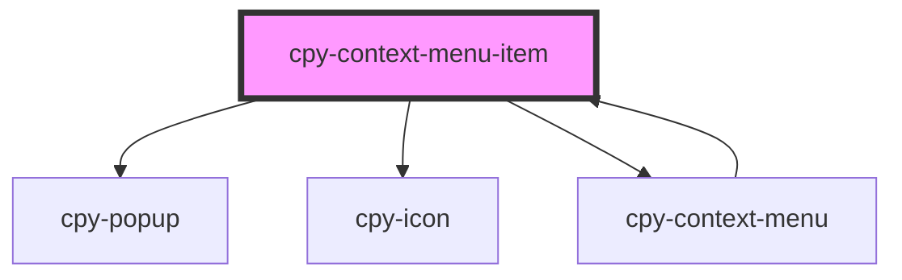

# cpy-recursive-menu-item

<!-- Auto Generated Below -->

## Properties

| Property | Attribute | Description | Type              | Default     |
| -------- | --------- | ----------- | ----------------- | ----------- |
| `item`   | --        |             | `ContextMenuItem` | `undefined` |

## Methods

### `recalculatePosition() => Promise<void>`

#### Returns

Type: `Promise<void>`

## Dependencies

### Used by

 - [cpy-context-menu](..)

### Depends on

- [cpy-popup](../../popup)
- [cpy-icon](../../icon)
- [cpy-context-menu](..)

### Graph

----------------------------------------------

*Built with [StencilJS](https://stenciljs.com/)*
