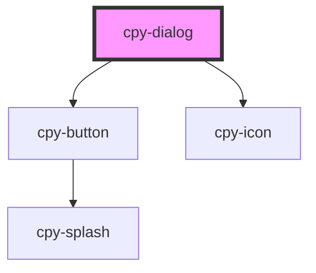

# cpy-dialog

<!-- Auto Generated Below -->

## Properties

| Property      | Attribute      | Description | Type                                               | Default     |
| ------------- | -------------- | ----------- | -------------------------------------------------- | ----------- |
| `dialogTitle` | `dialog-title` |             | `string`                                           | `undefined` |
| `size`        | `size`         |             | `"default" \| "full-screen" \| "large" \| "small"` | `'default'` |
| `zIndex`      | `z-index`      |             | `string`                                           | `'999'`     |

## Events

| Event    | Description | Type                |
| -------- | ----------- | ------------------- |
| `closed` |             | `CustomEvent<void>` |

## Methods

### `close() => Promise<void>`

#### Returns

Type: `Promise<void>`

### `open() => Promise<void>`

#### Returns

Type: `Promise<void>`

## Dependencies

### Depends on

- [cpy-button](../button)
- [cpy-icon](../icon)

### Graph

----------------------------------------------

*Built with [StencilJS](https://stenciljs.com/)*
