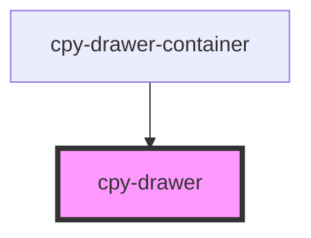

# cpy-drawer

<!-- Auto Generated Below -->

## Properties

| Property | Attribute | Description | Type               | Default  |
| -------- | --------- | ----------- | ------------------ | -------- |
| `mode`   | `mode`    |             | `"over" \| "side"` | `'side'` |
| `opened` | `opened`  |             | `boolean`          | `false`  |

## Events

| Event          | Description | Type                |
| -------------- | ----------- | ------------------- |
| `toggleOpened` |             | `CustomEvent<void>` |

## Dependencies

### Used by

 - [cpy-drawer-container](..)

### Graph

----------------------------------------------

*Built with [StencilJS](https://stenciljs.com/)*
