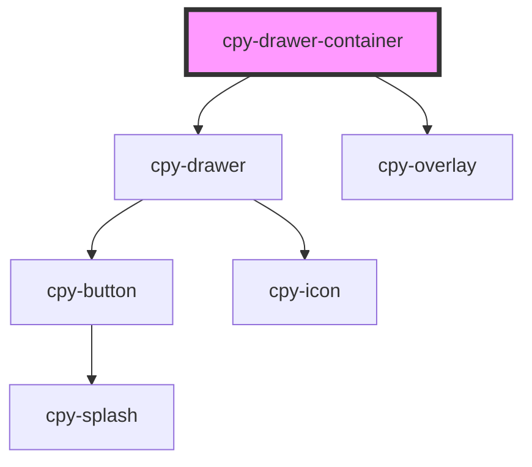

# cpy-drawer-container

<!-- Auto Generated Below -->

## Properties

| Property | Attribute | Description | Type      | Default |
| -------- | --------- | ----------- | --------- | ------- |
| `opened` | `opened`  |             | `boolean` | `false` |

## Events

| Event          | Description | Type                   |
| -------------- | ----------- | ---------------------- |
| `toggleDrawer` |             | `CustomEvent<boolean>` |

## Methods

### `toggle() => Promise<void>`

#### Returns

Type: `Promise<void>`

## Dependencies

### Depends on

- [cpy-drawer](drawer)
- [cpy-overlay](../overlay)

### Graph

----------------------------------------------

*Built with [StencilJS](https://stenciljs.com/)*
