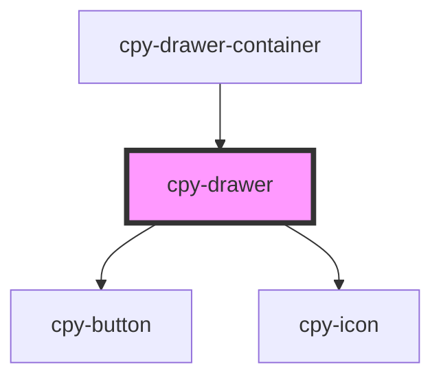

# cpy-drawer

<!-- Auto Generated Below -->

## Properties

| Property | Attribute | Description | Type      | Default |
| -------- | --------- | ----------- | --------- | ------- |
| `opened` | `opened`  |             | `boolean` | `false` |

## Events

| Event          | Description | Type                |
| -------------- | ----------- | ------------------- |
| `toggleOpened` |             | `CustomEvent<void>` |

## Dependencies

### Used by

 - [cpy-drawer-container](../drawer-container)

### Depends on

- [cpy-button](../button)
- [cpy-icon](../icon)

### Graph

----------------------------------------------

*Built with [StencilJS](https://stenciljs.com/)*
