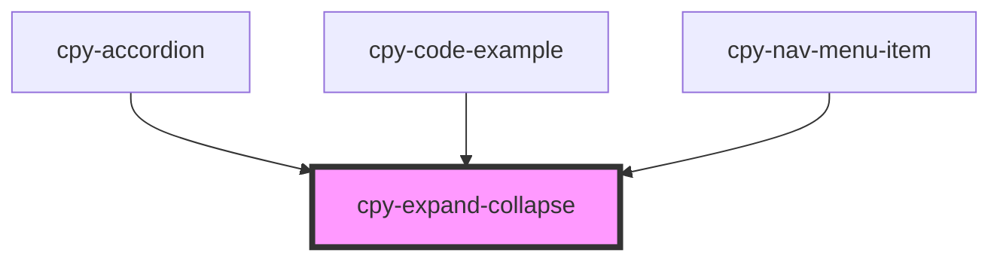

# cpy-expand-collapse

<!-- Auto Generated Below -->

## Properties

| Property   | Attribute  | Description | Type      | Default     |
| ---------- | ---------- | ----------- | --------- | ----------- |
| `duration` | `duration` |             | `number`  | `300`       |
| `expanded` | `expanded` |             | `boolean` | `undefined` |

## Events

| Event            | Description | Type                   |
| ---------------- | ----------- | ---------------------- |
| `toggleExpanded` |             | `CustomEvent<boolean>` |

## Methods

### `collapse() => Promise<void>`

#### Returns

Type: `Promise<void>`

### `expand() => Promise<void>`

#### Returns

Type: `Promise<void>`

### `toggle() => Promise<void>`

#### Returns

Type: `Promise<void>`

## Dependencies

### Used by

 - [cpy-accordion](../accordion)
 - [cpy-code-example](../code-example)
 - [cpy-nav-menu-item](../nav-menu/nav-menu-item)

### Graph

----------------------------------------------

*Built with [StencilJS](https://stenciljs.com/)*
