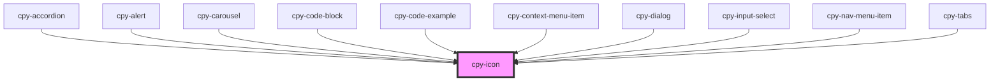

# cpy-icon

<!-- Auto Generated Below -->

## Dependencies

### Used by

 - [cpy-accordion](../accordion)
 - [cpy-alert](../alert)
 - [cpy-carousel](../carousel)
 - [cpy-code-block](../code-block)
 - [cpy-code-example](../code-example)
 - [cpy-context-menu-item](../context-menu/context-menu-item)
 - [cpy-dialog](../dialog)
 - [cpy-input-select](../inputs/input-select)
 - [cpy-nav-menu-item](../nav-menu/nav-menu-item)
 - [cpy-tabs](../tabs)

### Graph

----------------------------------------------

*Built with [StencilJS](https://stenciljs.com/)*
