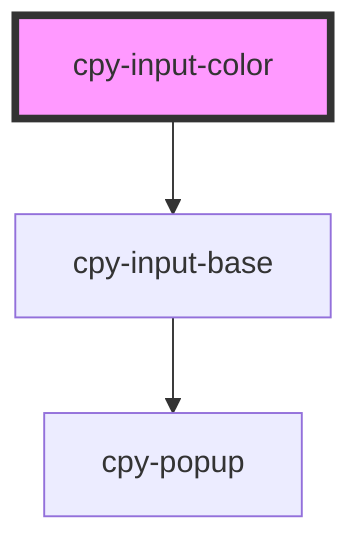

# cpy-input-color

<!-- Auto Generated Below -->

## Properties

| Property      | Attribute     | Description | Type                                                | Default     |
| ------------- | ------------- | ----------- | --------------------------------------------------- | ----------- |
| `accept`      | `accept`      |             | `string`                                            | `undefined` |
| `disabled`    | `disabled`    |             | `boolean`                                           | `undefined` |
| `label`       | `label`       |             | `string`                                            | `undefined` |
| `multiple`    | `multiple`    |             | `boolean`                                           | `false`     |
| `placeholder` | `placeholder` |             | `string`                                            | `undefined` |
| `required`    | `required`    |             | `boolean`                                           | `undefined` |
| `size`        | `size`        |             | `"default" \| "large" \| "small"`                   | `'default'` |
| `validators`  | --            |             | `(string \| ValidatorEntry \| Validator<string>)[]` | `undefined` |
| `value`       | `value`       |             | `string`                                            | `undefined` |

## Events

| Event         | Description | Type                  |
| ------------- | ----------- | --------------------- |
| `valueChange` |             | `CustomEvent<string>` |

## Methods

### `isValid() => Promise<boolean>`

#### Returns

Type: `Promise<boolean>`

### `markAsTouched() => Promise<void>`

#### Returns

Type: `Promise<void>`

### `markAsUntouched() => Promise<void>`

#### Returns

Type: `Promise<void>`

## Dependencies

### Depends on

- [cpy-input-base](..)

### Graph

----------------------------------------------

*Built with [StencilJS](https://stenciljs.com/)*
