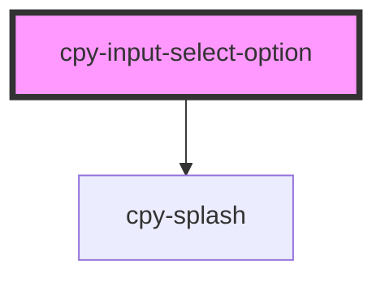

# cpy-input-select-option

<!-- Auto Generated Below -->

## Properties

| Property | Attribute | Description | Type                              | Default     |
| -------- | --------- | ----------- | --------------------------------- | ----------- |
| `active` | `active`  |             | `boolean`                         | `false`     |
| `label`  | `label`   |             | `string`                          | `undefined` |
| `size`   | `size`    |             | `"default" \| "large" \| "small"` | `'default'` |
| `value`  | `value`   |             | `number \| string`                | `undefined` |

## Events

| Event            | Description | Type                            |
| ---------------- | ----------- | ------------------------------- |
| `optionSelected` |             | `CustomEvent<number \| string>` |

## Dependencies

### Depends on

- [cpy-splash](../../../splash)

### Graph

----------------------------------------------

*Built with [StencilJS](https://stenciljs.com/)*
