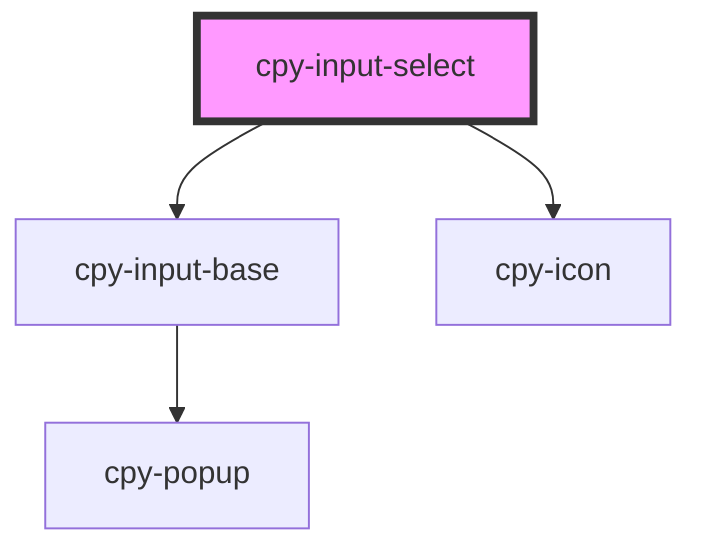

# cpy-input-select

<!-- Auto Generated Below -->

## Properties

| Property     | Attribute  | Description | Type                                                          | Default     |
| ------------ | ---------- | ----------- | ------------------------------------------------------------- | ----------- |
| `disabled`   | `disabled` |             | `boolean`                                                     | `false`     |
| `label`      | `label`    |             | `string`                                                      | `undefined` |
| `required`   | `required` |             | `boolean`                                                     | `false`     |
| `size`       | `size`     |             | `"default" \| "large" \| "small"`                             | `'default'` |
| `validators` | --         |             | `(string \| ValidatorEntry \| Validator<string \| number>)[]` | `undefined` |
| `value`      | `value`    |             | `number \| string`                                            | `undefined` |

## Events

| Event         | Description | Type                            |
| ------------- | ----------- | ------------------------------- |
| `inputChange` |             | `CustomEvent<number \| string>` |

## Methods

### `isValid() => Promise<boolean>`

#### Returns

Type: `Promise<boolean>`

### `markAsTouched() => Promise<void>`

#### Returns

Type: `Promise<void>`

## Dependencies

### Depends on

- [cpy-input-base](..)
- [cpy-icon](../../icon)

### Graph

----------------------------------------------

*Built with [StencilJS](https://stenciljs.com/)*
