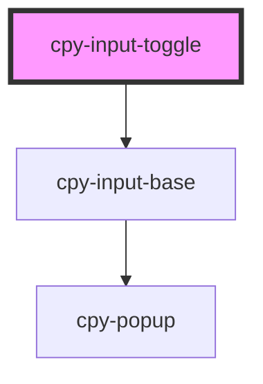

# cpy-toggle

<!-- Auto Generated Below -->

## Properties

| Property      | Attribute      | Description | Type                                                 | Default     |
| ------------- | -------------- | ----------- | ---------------------------------------------------- | ----------- |
| `disabled`    | `disabled`     |             | `boolean`                                            | `false`     |
| `label`       | `label`        |             | `string`                                             | `undefined` |
| `required`    | `required`     |             | `boolean`                                            | `false`     |
| `size`        | `size`         |             | `"default" \| "large" \| "small"`                    | `'default'` |
| `switchAfter` | `switch-after` |             | `boolean`                                            | `false`     |
| `validators`  | --             |             | `(string \| ValidatorEntry \| Validator<boolean>)[]` | `undefined` |
| `value`       | `value`        |             | `boolean`                                            | `false`     |

## Events

| Event         | Description | Type                   |
| ------------- | ----------- | ---------------------- |
| `valueChange` |             | `CustomEvent<boolean>` |

## Methods

### `isValid() => Promise<boolean>`

#### Returns

Type: `Promise<boolean>`

### `markAsTouched() => Promise<void>`

#### Returns

Type: `Promise<void>`

### `markAsUntouched() => Promise<void>`

#### Returns

Type: `Promise<void>`

## Dependencies

### Depends on

- [cpy-input-base](..)

### Graph

----------------------------------------------

*Built with [StencilJS](https://stenciljs.com/)*
