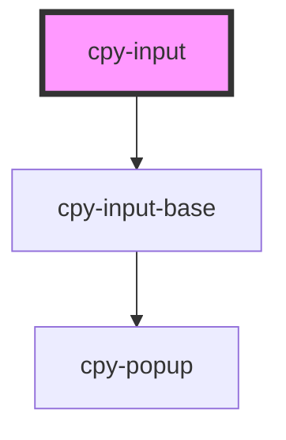

# cpy-input

<!-- Auto Generated Below -->

## Properties

| Property      | Attribute     | Description | Type                                                          | Default     |
| ------------- | ------------- | ----------- | ------------------------------------------------------------- | ----------- |
| `disabled`    | `disabled`    |             | `boolean`                                                     | `undefined` |
| `label`       | `label`       |             | `string`                                                      | `undefined` |
| `placeholder` | `placeholder` |             | `string`                                                      | `undefined` |
| `required`    | `required`    |             | `boolean`                                                     | `undefined` |
| `size`        | `size`        |             | `"default" \| "large" \| "small"`                             | `'default'` |
| `type`        | `type`        |             | `"email" \| "number" \| "password" \| "text"`                 | `'text'`    |
| `validators`  | --            |             | `(string \| ValidatorEntry \| Validator<string \| number>)[]` | `undefined` |
| `value`       | `value`       |             | `number \| string`                                            | `undefined` |

## Events

| Event         | Description | Type                            |
| ------------- | ----------- | ------------------------------- |
| `valueChange` |             | `CustomEvent<number \| string>` |

## Methods

### `isValid() => Promise<boolean>`

#### Returns

Type: `Promise<boolean>`

### `markAsTouched() => Promise<void>`

#### Returns

Type: `Promise<void>`

## Dependencies

### Depends on

- [cpy-input-base](..)

### Graph

----------------------------------------------

*Built with [StencilJS](https://stenciljs.com/)*
