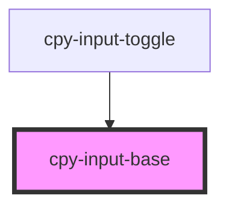

# cpy-input-text

<!-- Auto Generated Below -->

## Properties

| Property      | Attribute      | Description | Type                              | Default     |
| ------------- | -------------- | ----------- | --------------------------------- | ----------- |
| `disabled`    | `disabled`     |             | `boolean`                         | `undefined` |
| `error`       | `error`        |             | `string`                          | `undefined` |
| `interacted`  | `interacted`   |             | `boolean`                         | `false`     |
| `label`       | `label`        |             | `string`                          | `undefined` |
| `noContainer` | `no-container` |             | `boolean`                         | `false`     |
| `required`    | `required`     |             | `boolean`                         | `undefined` |
| `size`        | `size`         |             | `"default" \| "large" \| "small"` | `'default'` |

## Dependencies

### Used by

 - [cpy-input-toggle](input-toggle)

### Graph

----------------------------------------------

*Built with [StencilJS](https://stenciljs.com/)*
