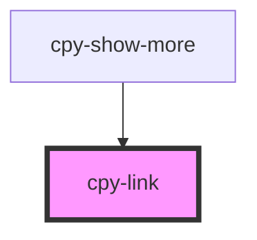

# cpy-link

<!-- Auto Generated Below -->

## Properties

| Property | Attribute | Description | Type                                  | Default     |
| -------- | --------- | ----------- | ------------------------------------- | ----------- |
| `func`   | --        |             | `() => void`                          | `undefined` |
| `href`   | `href`    |             | `string`                              | `undefined` |
| `newTab` | `new-tab` |             | `boolean`                             | `undefined` |
| `type`   | `type`    |             | `"basic" \| "primary" \| "secondary"` | `'primary'` |

## Dependencies

### Used by

 - [cpy-show-more](../show-more)

### Graph

----------------------------------------------

*Built with [StencilJS](https://stenciljs.com/)*
