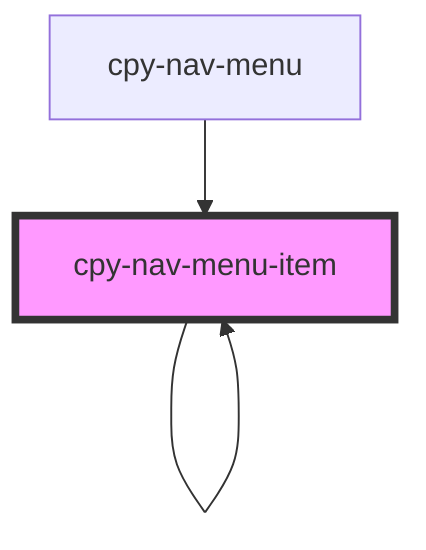

# cpy-nav-menu-item

<!-- Auto Generated Below -->

## Properties

| Property | Attribute | Description | Type          | Default     |
| -------- | --------- | ----------- | ------------- | ----------- |
| `item`   | --        |             | `NavMenuItem` | `undefined` |

## Events

| Event        | Description | Type                |
| ------------ | ----------- | ------------------- |
| `itemActive` |             | `CustomEvent<void>` |

## Dependencies

### Used by

 - [cpy-nav-menu](..)
 - [cpy-nav-menu-item](.)

### Depends on

- [cpy-icon](../../icon)
- [cpy-splash](../../splash)
- [cpy-nav-menu-item](.)
- [cpy-expand-collapse](../../expand-collapse)

### Graph

----------------------------------------------

*Built with [StencilJS](https://stenciljs.com/)*
