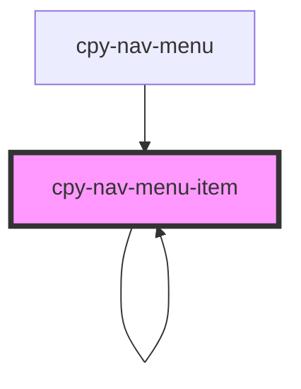

# cpy-nav-menu-item

<!-- Auto Generated Below -->

## Properties

| Property | Attribute | Description | Type          | Default     |
| -------- | --------- | ----------- | ------------- | ----------- |
| `item`   | --        |             | `NavMenuItem` | `undefined` |

## Dependencies

### Used by

 - [cpy-nav-menu](.)
 - [cpy-nav-menu-item](.)

### Depends on

- [cpy-icon](../icon)
- [cpy-nav-menu-item](.)

### Graph

----------------------------------------------

*Built with [StencilJS](https://stenciljs.com/)*
