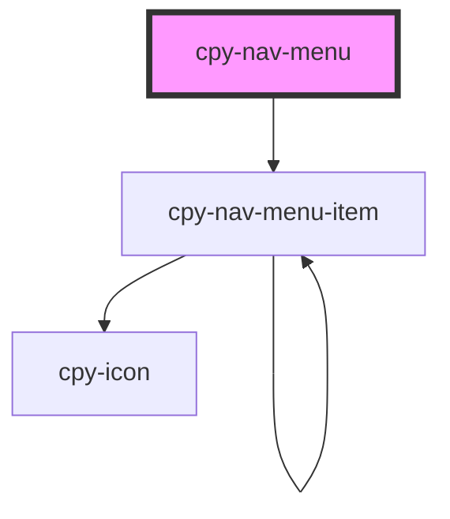

# cpy-nav-menu-item

<!-- Auto Generated Below -->

## Properties

| Property | Attribute | Description | Type            | Default     |
| -------- | --------- | ----------- | --------------- | ----------- |
| `items`  | --        |             | `NavMenuItem[]` | `undefined` |

## Dependencies

### Depends on

- [cpy-nav-menu-item](nav-menu-item)

### Graph

----------------------------------------------

*Built with [StencilJS](https://stenciljs.com/)*
