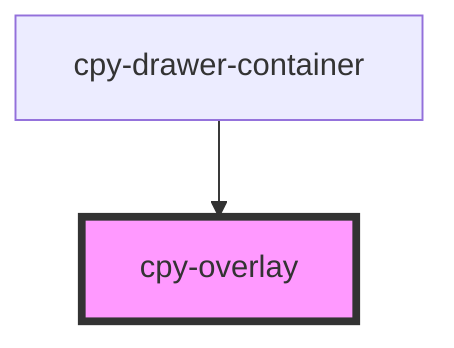

# cpy-overlay

<!-- Auto Generated Below -->

## Properties

| Property           | Attribute            | Description | Type      | Default |
| ------------------ | -------------------- | ----------- | --------- | ------- |
| `hasBackdropClick` | `has-backdrop-click` |             | `boolean` | `true`  |
| `show`             | `show`               |             | `boolean` | `false` |
| `zIndex`           | `z-index`            |             | `string`  | `'999'` |

## Events

| Event           | Description | Type                |
| --------------- | ----------- | ------------------- |
| `backdropClick` |             | `CustomEvent<void>` |
| `closed`        |             | `CustomEvent<void>` |

## Methods

### `close() => Promise<void>`

#### Returns

Type: `Promise<void>`

### `open() => Promise<void>`

#### Returns

Type: `Promise<void>`

### `toggle(show: boolean) => Promise<void>`

#### Returns

Type: `Promise<void>`

## Dependencies

### Used by

 - [cpy-drawer-container](../drawer-container)

### Graph

----------------------------------------------

*Built with [StencilJS](https://stenciljs.com/)*
