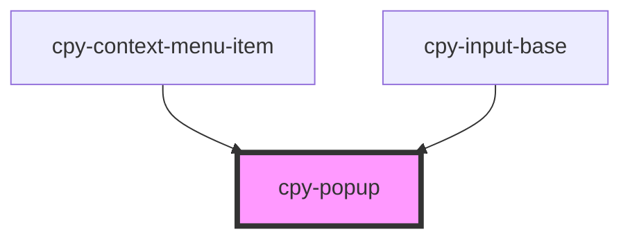

# cpy-popup

<!-- Auto Generated Below -->

## Properties

| Property   | Attribute   | Description | Type                                                             | Default          |
| ---------- | ----------- | ----------- | ---------------------------------------------------------------- | ---------------- |
| `activeOn` | `active-on` |             | `"click" \| "hover"`                                             | `'click'`        |
| `disabled` | `disabled`  |             | `boolean`                                                        | `false`          |
| `position` | `position`  |             | `"bottom-start" \| "left-start" \| "right-start" \| "top-start"` | `'bottom-start'` |
| `stretch`  | `stretch`   |             | `boolean`                                                        | `false`          |

## Events

| Event    | Description | Type                |
| -------- | ----------- | ------------------- |
| `closed` |             | `CustomEvent<void>` |
| `opened` |             | `CustomEvent<void>` |

## Methods

### `hide() => Promise<void>`

#### Returns

Type: `Promise<void>`

### `recalculatePosition() => Promise<void>`

#### Returns

Type: `Promise<void>`

### `show() => Promise<void>`

#### Returns

Type: `Promise<void>`

## Dependencies

### Used by

 - [cpy-context-menu-item](../context-menu/context-menu-item)
 - [cpy-input-base](../inputs)

### Graph

----------------------------------------------

*Built with [StencilJS](https://stenciljs.com/)*
