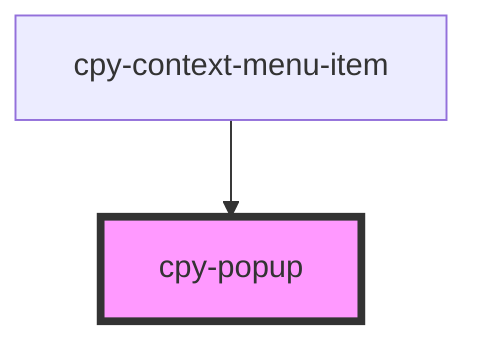

# cpy-popup

<!-- Auto Generated Below -->

## Properties

| Property   | Attribute   | Description | Type                                                             | Default          |
| ---------- | ----------- | ----------- | ---------------------------------------------------------------- | ---------------- |
| `activeOn` | `active-on` |             | `"click" \| "hover"`                                             | `'click'`        |
| `position` | `position`  |             | `"bottom-start" \| "left-start" \| "right-start" \| "top-start"` | `'bottom-start'` |

## Dependencies

### Used by

 - [cpy-context-menu-item](../context-menu/context-menu-item)

### Graph

----------------------------------------------

*Built with [StencilJS](https://stenciljs.com/)*
