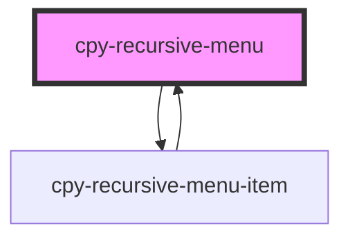

# cpy-recursive-menu-item

<!-- Auto Generated Below -->

## Properties

| Property | Attribute | Description | Type                  | Default     |
| -------- | --------- | ----------- | --------------------- | ----------- |
| `items`  | --        |             | `RecursiveMenuItem[]` | `undefined` |

## Dependencies

### Used by

 - [cpy-recursive-menu-item](recursive-menu-item)

### Depends on

- [cpy-recursive-menu-item](recursive-menu-item)

### Graph

----------------------------------------------

*Built with [StencilJS](https://stenciljs.com/)*
