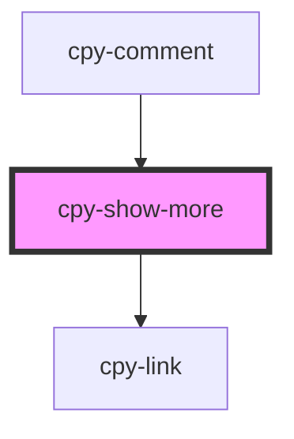

# cpy-show-more

<!-- Auto Generated Below -->

## Properties

| Property       | Attribute        | Description | Type                                                                    | Default       |
| -------------- | ---------------- | ----------- | ----------------------------------------------------------------------- | ------------- |
| `lines`        | `lines`          |             | `number`                                                                | `3`           |
| `showLessText` | `show-less-text` |             | `string`                                                                | `'show less'` |
| `showMoreText` | `show-more-text` |             | `string`                                                                | `'show more'` |
| `text`         | `text`           |             | `string`                                                                | `undefined`   |
| `type`         | `type`           |             | `"basic" \| "error" \| "primary" \| "secondary" \| "success" \| "warn"` | `'primary'`   |

## Dependencies

### Used by

 - [cpy-comment](../comment)

### Depends on

- [cpy-link](../link)

### Graph

----------------------------------------------

*Built with [StencilJS](https://stenciljs.com/)*
