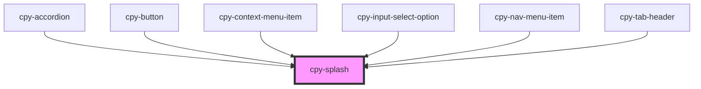

# cpy-overlay

<!-- Auto Generated Below -->

## Properties

| Property   | Attribute  | Description | Type      | Default |
| ---------- | ---------- | ----------- | --------- | ------- |
| `disabled` | `disabled` |             | `boolean` | `false` |

## Dependencies

### Used by

 - [cpy-accordion](../accordion)
 - [cpy-button](../button)
 - [cpy-context-menu-item](../context-menu/context-menu-item)
 - [cpy-input-select-option](../inputs/input-select/input-select-option)
 - [cpy-nav-menu-item](../nav-menu/nav-menu-item)
 - [cpy-tab-header](../tabs/tab-header)

### Graph

----------------------------------------------

*Built with [StencilJS](https://stenciljs.com/)*
