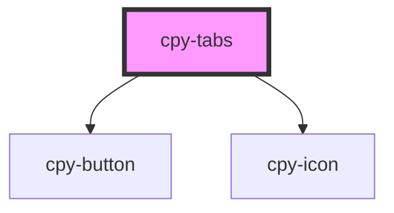

# cpy-tabs

<!-- Auto Generated Below -->

## Properties

| Property      | Attribute      | Description | Type     | Default |
| ------------- | -------------- | ----------- | -------- | ------- |
| `activeIndex` | `active-index` |             | `number` | `0`     |

## Events

| Event        | Description | Type                  |
| ------------ | ----------- | --------------------- |
| `tabChanged` |             | `CustomEvent<number>` |

## Dependencies

### Depends on

- [cpy-button](../button)
- [cpy-icon](../icon)

### Graph

----------------------------------------------

*Built with [StencilJS](https://stenciljs.com/)*
