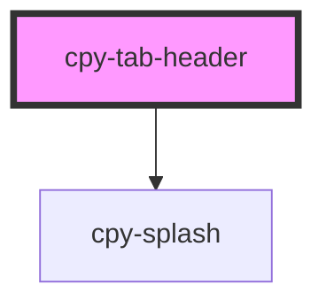

# cpy-tab-header

<!-- Auto Generated Below -->

## Properties

| Property   | Attribute   | Description | Type     | Default        |
| ---------- | ----------- | ----------- | -------- | -------------- |
| `headerId` | `header-id` |             | `string` | `generateId()` |
| `tabTitle` | `tab-title` |             | `string` | `undefined`    |

## Events

| Event      | Description | Type                  |
| ---------- | ----------- | --------------------- |
| `selected` |             | `CustomEvent<string>` |

## Dependencies

### Depends on

- [cpy-splash](../../splash)

### Graph

----------------------------------------------

*Built with [StencilJS](https://stenciljs.com/)*
