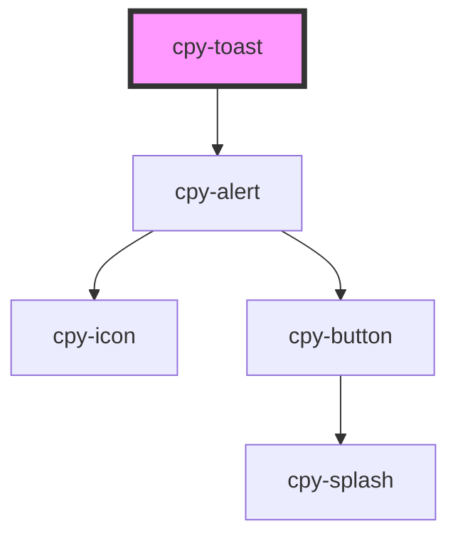

# cpy-toast

<!-- Auto Generated Below -->

## Properties

| Property      | Attribute     | Description | Type                                                                                            | Default     |
| ------------- | ------------- | ----------- | ----------------------------------------------------------------------------------------------- | ----------- |
| `dismissible` | `dismissible` |             | `boolean`                                                                                       | `false`     |
| `duration`    | `duration`    |             | `number`                                                                                        | `4000`      |
| `icon`        | `icon`        |             | `string`                                                                                        | `undefined` |
| `position`    | `position`    |             | `"bottom-end" \| "bottom-middle" \| "bottom-start" \| "top-end" \| "top-middle" \| "top-start"` | `'top-end'` |
| `toastTitle`  | `toast-title` |             | `string`                                                                                        | `undefined` |
| `type`        | `type`        |             | `"basic" \| "error" \| "primary" \| "secondary" \| "success" \| "warn"`                         | `undefined` |
| `zIndex`      | `z-index`     |             | `string`                                                                                        | `'50'`      |

## Events

| Event    | Description | Type                |
| -------- | ----------- | ------------------- |
| `closed` |             | `CustomEvent<void>` |
| `opened` |             | `CustomEvent<void>` |

## Methods

### `close() => Promise<void>`

#### Returns

Type: `Promise<void>`

### `open() => Promise<void>`

#### Returns

Type: `Promise<void>`

## Dependencies

### Depends on

- [cpy-alert](../alert)

### Graph

----------------------------------------------

*Built with [StencilJS](https://stenciljs.com/)*
