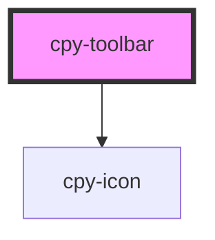

# cpy-toolbar

<!-- Auto Generated Below -->

## Properties

| Property   | Attribute   | Description | Type      | Default |
| ---------- | ----------- | ----------- | --------- | ------- |
| `showMenu` | `show-menu` |             | `boolean` | `false` |

## Events

| Event        | Description | Type                |
| ------------ | ----------- | ------------------- |
| `toggleMenu` |             | `CustomEvent<void>` |

## Dependencies

### Depends on

- [cpy-icon](../icon)

### Graph

----------------------------------------------

*Built with [StencilJS](https://stenciljs.com/)*
