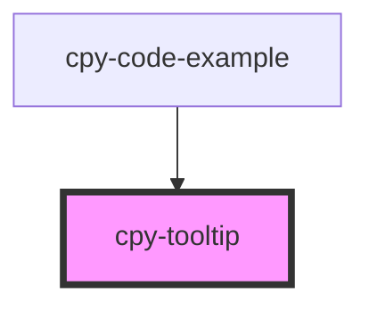

# cpy-tooltip

<!-- Auto Generated Below -->

## Properties

| Property    | Attribute    | Description | Type                                     | Default     |
| ----------- | ------------ | ----------- | ---------------------------------------- | ----------- |
| `hideArrow` | `hide-arrow` |             | `boolean`                                | `false`     |
| `position`  | `position`   |             | `"bottom" \| "left" \| "right" \| "top"` | `'bottom'`  |
| `text`      | `text`       |             | `string`                                 | `undefined` |

## Dependencies

### Used by

 - [cpy-code-example](../code-example)

### Graph

----------------------------------------------

*Built with [StencilJS](https://stenciljs.com/)*
